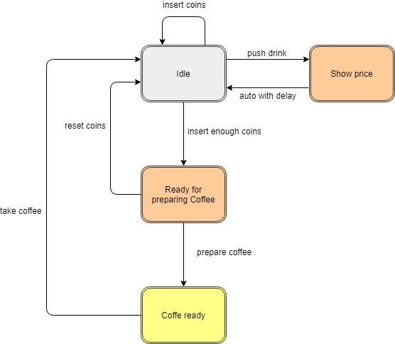

# GraphQL for Coffee Machine

GraphQL example with Angular and Node.js

Thinking an easy program to learn GraphQL, when I was at work, in front of my friend, the coffee machine, I decided that my friend could be a good starting point for the goal.

So what I wanted were the following things:

- querying a subset of data
- managing different sources
- mutating data
- handling subscriptions

For the moment the above aims can be enough.

## Coffee Machine Components

Coffee Machine has the below components:

- coffee-machine is the front end for taking coffee and adding custom coffee
- graphql-gateway manages data from queries and mutations

Currently there are 2 different sources inside the graphql-gateway:

- Default Coffees, managed by the default-coffee.service
- Custom Coffees, managed by the custom-coffee.service

A better solution is to move these services inside other components in order to have the gateway clean from specific sources.

The gateway, through the resolver, should merge these sources.

## Run the Coffee Machine

Under the graphql-gateway folder, from a cmd with administrative privileges, type:

    npm install
    npm start

Under the coffee-machine folder, from a cmd with administrative privileges, type:

    npm install
    ng serve

The default port for the front end is 4200:

    http://localhost:4200/

The default configurations are in:

- assets/config.json for the gateway
- environment.ts for the front end

## How to use the Coffee Machine

As a normal Coffee Machine, you can:

- check the price of the coffees
- choose the sugar
- add coins
- take a coffee => don't forget to take it when it's ready!

In addition you can create your custom coffee:

- choose coffee powder
- choose milk
- other parameters

## State Coffee Machine

The below chart show the states of the Coffee Machine.

Note:

- the rest doesn't return

## Tests

To run some tests on the client side, type:

    ng test

## Docker

Running on Docker wants be an easy test without complicate things that can be added in next steps. For the moment we can avoid configuration files or environment variables to have more customizable parameters.

### graphql-gateway

The steps to dockerize the server are the following:

- Go under the graphql-gateway folder and build the image:

        docker build -t coffee-machine-server .

- Run the container:

        docker run -p 2000:2000 coffee-machine-server

### coffee-machine

The steps to dockerize the client are the following:

- Go under the coffee-machine folder and build the image:

        docker build -t coffee-machine-client .

- Run the container:

        docker run -p 8080:80 coffee-machine-client

Now, browsing the client at the below url, it's possible to take a coffee:

    http://localhost:8080

## References

- <https://graphql.org/>
- <https://medium.com/@ajaysaini.official/why-graphql-886ba866ae75>
- https://www.freecodecamp.org/news/rest-apis-are-rest-in-peace-apis-long-live-graphql-d412e559d8e4/

### Front end

- <https://www.apollographql.com/docs/angular/basics/setup/>
- <https://code-maze.com/consuming-graphql-api-angular/>
- <https://graphql-code-generator.com/docs/getting-started/>
- <https://medium.com/naresh-bhatia/graphql-concepts-i-wish-someone-explained-to-me-a-year-ago-514d5b3c0eab>

### Gateway

- <https://medium.com/@itReverie/subscriptions-in-graphql-with-apollo-2-0-6db44401f009>
- <https://hashnode.com/post/building-a-nodejs-api-with-typescript-and-graphql-cjrrojjx200uqrxs1ngtitx9p>

### Docker

- <https://malcoded.com/posts/angular-docker/>
